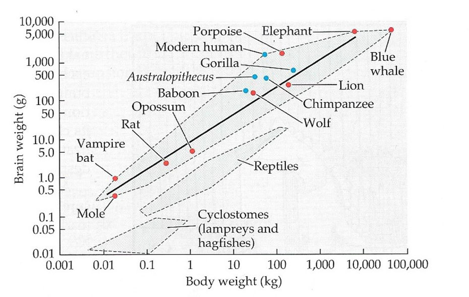

# Neuroscience-And-Behavior

This repository was made when I studied this [course](https://www.youtube.com/watch?v=gkrM1gMpqRU&list=PLtXCbh6IFA7QCsei-t8WesusKi8I2LXUJ) taught by the professor [Wendy Suzuki](https://www.wendysuzuki.com) a Professor of Neural Science and Psychology in the Center for Neural Science at New York University.

Her major research interest continues to be brain plasticity. She is best known for her extensive work studying areas in the brain critical for our ability to form and retain new long-term memories. More recently her work has focused on understanding how aerobic exercise can be used to improve learning, memory and higher cognitive abilities in humans.

**Flashcard** :
[Here](https://ankiweb.net/shared/info/281778891) is my deck of Flashcard for this repository.
If you don't know what flashcard is i **HIGLY recommand** you to learn on the subject.There are a **CRUCIAL** tool to learn and retain memory efficiently.
_______________________
## What are the major component of the nervous system?
Central nervous system **(CNS)** | Peripheral nervous system **(PNS)**

 

## 1. What does the CNS is made of and What does it do?
The **Central Nervous System** is made of the **Brain** and the **Spinal cord**.

**Generates behavior** (observed and non-observed)
It **mediates** all **sensory** input and **motor** output.

### 1.1 The brain
The brain can be separated in different part. First of all the brain is separated in two distinct hemisphere. These two have the same part called lobes.

#### 1.1.1 Hemisphere
| Left hemisphere            | Right hemisphere       |
|:-------------------------- |:---------------------- |
| Analytical though          | Intutive Thought       |
| Detail Oriented Perception | Holistic Perception    |
| Ordered Sequencing         | Random Sequencing      |
| Rational thought           | Emotional Thought      |
| Verbal                     | Non-verbal             |
| Cautious                   | Adventurous            |
| planning                   | Impulse                |
| Math/Science               | Creative Writing/Art   |
| Logic                      | Imagination            |
| Right field vision         | Left Field Vision      |
| Right side motor skills    | Left Side Motor Skills |

#### 1.1.2 Lobes
| Frontal lobe    | Temporal lobe | Occipital lobe | Parietal lobe |
|:--------------- |:------------- | -------------- | ------------- | ------------ |
|Controls executive functions like concentration, thinking, problem solving and judgment; motivation, emotions, Behavior| Controls processing feelings of pain and hunger, fight-or-flight stress response, short-term memory, emotion, understanding words and directions | Controls sight and processing information from the eyes, such as recognizing images | Controls feeling on the opposite side of the body, ability to understand spoken language, and processing sensory information such as texture, temperature, and position in space |

#### 1.1.3 Subpart
| part          | description |
|:------------- |:----------- |
| Cerebelum     |  plays an important role in motor control. It may also be involved in some cognitive functions such as attention and language as well as in regulating fear and pleasure responses, but its movement-related functions are the most solidly established. The human cerebellum does not initiate movement, but contributes to coordination, precision, and accurate timing: it receives input from sensory systems of the spinal cord and from other parts of the brain, and integrates these inputs to fine-tune motor activity. Cerebellar damage produces disorders in fine movement, equilibrium, posture, and motor learning in humans. |
| Broca area    |  Language processing/Speech production        |
| Wernicke area |   It is involved in the comprehension of written and spoken language |
| hypothalamus  |             |
|Thalamus       |             |
| hippocampus   |            |
| Amygdala |
| Sensory strip | |
| Motor strip   |
| Corpus callosum |
|Brain stem /medulla |
|Pons |
| Pituitary |

### 1.2 Spinal cord
/!\not finished/!\

## 2. What does the PNS is made of and What does it do?
The **Peripheral nervous system** is made of the Cranial nerves, Spinal nerves, and Autonomic nervous system.

It carries the **sensory information into the CNS** and the **motor information out of the CNS**.

#### 2.1.1 Cranial nerves

Listed from the most anterior to the most posterior.

| number | nerves            | type    |
| ------ | ----------------- | ------- |
| 1      | Olfactory         | Sensory |
| 2      | Optic             | Sensory |
| 3      | Oculomotor        | Motor   |
| 4      | Trochlear         | Motor   |
| 5      | Trigeminal        | Both    |
| 6      | Abducens          | Motor   |
| 7      | Facial            | Both    |
| 8      | Vestibulocochlear | Sensory |
| 9      | Glossopharyngeal  | Both    |
| 10     | Vagus             | Both    |
| 11     | Spinal accessory  | Motor   |
| 12     | Hypoglossal       | Motor   |

### 1.2 The spinal cord

### Spinal nerves

31 pairs

- 8 pairs of **Cervical** spinal nerves.

  - 5 in the Cervical plexus
  - 5 in the  Brachial plexus

- 12 pairs of **Thoracic** spinal nerves.

- 5 pairs of **Lumbar** spinal nerves.
- 5 pairs of **Sacral** spinal nerves.
- 1 pairs of **Coccygal** nerves.

plexus =  bundle/hub

### Autonomic nervous system (**ANS**)
The Autonomic Nervous system control your organs Unconsciously. It control your body temperature, the blood flow, the heartbeat and so on.

The ANS is made of two component :
The **Parasympathetic** and the **Sympathetic** nervous system.

#### Parasympathetic (**PSNS**)
It is the **Rest and Digest mode**

#### Sympathetic (**SNS**)
It is the **Fight or Flight mode**.

________________________________
#### Neurones

Dendrites
- Input zone
- Receive input from 100+ other neurones
- Many per cell/neuron
Axon
- Carries output from cell
- Usually 1 per cell
- Transport chemicals from cell body to terminals
- Transmit electrical impulses to terminals (speed determined by size, myelin coating)
- Sends outputs to 100+ other neurones
[Myelin](https://en.wikipedia.org/wiki/Myelin)
- Insulates nerve cell axons to increase the speed at which information (encoded as an electrical signal) travels from one nerve cell body to another.

#### Glia
Type of Glia
- Astrocytes
- Microglia - multiply at inju
- Oligodendrocytes - make myelin in the CNS
- Schwann cells - make [Myelin](https://en.wikipedia.org/wiki/Myelin) in the PNS

## How neurones communicate?

### Action potential
The membrane of the axon is a **lipid bilayer** (two layer of lipid molecule).

Channels exist within the lipid bilayer, these ion channels are little protein holes that **connect the extracellular space to the intracellular space**. they span the membrane and allow particular ions to pass and depending to the kind of ions channel it allow the little ions to pass.

There is ion channel that are just open all the time.
And there are specialized ion channels called gated ion channel :
- **Open channel** open all the time and allow only potassium ions (K+) to cross

- **Voltage gated ion channel** only open if the voltage goes to a particular level.

- **Chemically gated ion channels** only open if there is a particular chemical.

- **Mechanically gated ion channels** open with physical force.

The neuron shows selective permeability to (potassium k+) it can enter or leave the cell freely.
The two opposing forces that drive ion movement :

- Diffusion cause ions to flow from areas of high to low concentration, along their concentration gradient.

- Electrostatic pressure cause ions to flow towards oppositely charged areas.

What is making the action potential

## Neurotransmitter
### Family and subfamily
| Family And subfamily | Header Two |
|:-------------------- |:---------- |
| Amines               |            |
| Amino Acids          |            |
| Neuropeptides        |            |
| Neuropeptides        |            |
| gases                |            |

## Drugs
A drug is any substance (other than food that provides nutritional support) that, when inhaled, injected, smoked, consumed, absorbed via a patch on the skin, or dissolved under the tongue causes a physiological (and often psychological) change in the body.

It is important to know that we don't know the exact effect of drugs on the brain.
i.g we are aware of the main and obvious effect of Marijuana and cocain for example, but these drugs are doing a lot of things that we are not precisely aware yet.

### Alcohol

#### Child with alcohol syndrome

### Marijuana

### Cocaine

## Endocrine System

### Hormones
**Hormones** are chemicals secreted by one cell group, that travel through the bloodstream to act on targets.

What do hormones do exactly ?
They exert effect on cells and tissues in the body by promoting proliferation growth and differentiation of cells they also modulate cell activity.

**Protein hormone** or peptide hormone-a string of amino acids.
**Amine hormones**-modified amino acids, called monoamine hormones.
Protein and Amine hormone act "rapidly" (hormone are slow but they are the fastest)
**Steroid hormones**-four rings of carbon atoms.

How are hormones a regulated?

| Target cell feedback | negative feedback | brain regulation |
|:-------------------- |:----------------- | ---------------- |
| Item One             | Item Two          |                  |

### Endocrine glands
**Endocrine glands** release hormones within the body.

### Pituitary gland
The **Pituitary** also called the Master gland, because it **secretes** many **extremely important hormones** and **regulates** the activity of other hormone secreting **glands**.

The Pituitary gland is located under the hypothalamus which is logical because the hypothalamus is the "hub" between the sympathetic system and the Endocrine system.

The anterior and posterior pituitary are responsible for the secretion of the following hormones:

| anterior                      | posterior   |
|:----------------------------- |:----------- |
| **Growth Hormone**                | **Oxytocin** (compassion, social bonding, facilitate childbirth and lactation)   |
| **(FSH) Follicle-stimulating hormones** (development and reproduction) | **Vasopressin** (regulate blood pressure and control urine output)|
| **(LH) Luteinizing hormone** (testosterone production and reproduction)          |             |
| **(ACTH) Adrenocorticotropic Hormone** (stress and fear responses)   |             |
| **(TSH) Thyroid-stimulating hormone** (important to healthy metabolism)  |             |
| **Prolactin**  (milk production)                   |             |

## Evolution

 Darwin's hypothesis:
 1. reproduction will increase a population rapidly unless factors limit it.
 2. Individual of a species are note identical.
 3. Some variation is inherited.
 4. Not all offspring survive to reproduce.

What are the major similarities between human and rats?
1. Development from neural tube
2. Bilateral symmetry
3. Segmentation
4. Hierarchical control
5. Separate systems
6. Localization

## Encephalization factor
Encephalization quotient

